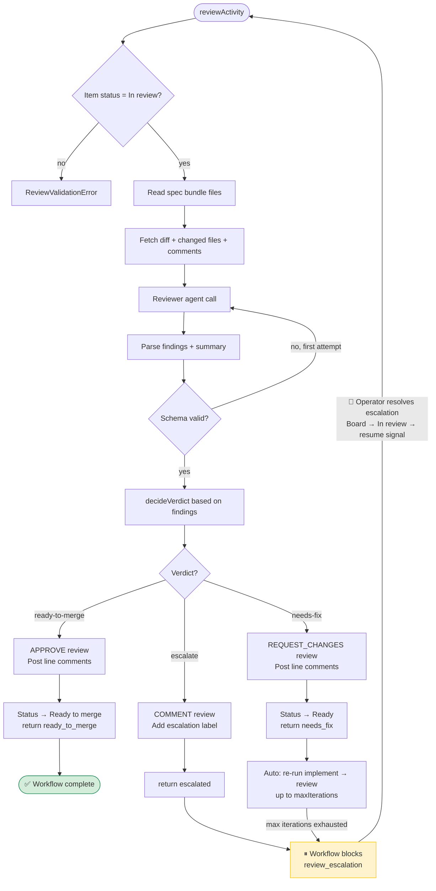

# Night Shift

Turn tickets into reviewable PRs with measurable quality, cost, and latency — so human engineers spend their time on the work that actually needs them.

See [`openspec/specs/`](openspec/specs/) for the current specs and [`openspec/changes/`](openspec/changes/) for active changes.

## Setup

### 1. Developing Night Shift

Use this mode when you are editing this repository and want to run workers and
commands from the Night Shift checkout against a separate target repository.

#### Prerequisites

- **Node.js >= 22.9**
- **Temporal CLI** so you can run `temporal server start-dev`
- **A target repository** that Night Shift should automate

#### Fast path

1. Install dependencies in this repository.

```bash
cd /abs/path/to/night-shift
npm install
```

2. Install the local Night Shift checkout into the target repository.

```bash
cd /abs/path/to/target-repo
npm install --save-dev /abs/path/to/night-shift
```

3. Initialize the target repository.

```bash
cd /abs/path/to/target-repo
npm exec night-shift -- init
```

`init` writes `night-shift.config.ts` and prints the OpenSpec setup commands you
still need to run in the target repository.

4. Configure the target repository.

- Update `night-shift.config.ts` with the role models, quality gates, and GitHub project settings you want.
- Create `.env` in the target repository and set the GitHub token plus the project and repo values Night Shift should use. `init` does not create this file for you.

```env
GITHUB_TOKEN=ghp_...
GITHUB_PROJECT_OWNER=your-username-or-org
GITHUB_PROJECT_OWNER_TYPE=user
GITHUB_PROJECT_NUMBER=1
GITHUB_REPO_OWNER=your-username
GITHUB_REPO_NAME=your-repo
```

5. Start Temporal in one terminal.

```bash
temporal server start-dev
```

6. Run Night Shift from this repository and point it at the target repository.

```bash
cd /abs/path/to/night-shift
npm run worker -- --repo-root /abs/path/to/target-repo
```

Useful commands during local development:

```bash
cd /abs/path/to/night-shift

npm run start -- <projectItemId> --change <change-name> --repo-root /abs/path/to/target-repo
npm run pickup -- --repo-root /abs/path/to/target-repo
npm run specify -- --item <projectItemId> --change <change-name> --repo-root /abs/path/to/target-repo
npm run implement -- --item <projectItemId> --change <change-name> --repo-root /abs/path/to/target-repo
npm run review -- <projectItemId> --repo-root /abs/path/to/target-repo
```

Source edits in this repository are picked up on the next run. Reinstall the
local dependency in the target repository only when package metadata changes,
such as `package.json`, `bin`, or `exports`.

#### Verify changes in Night Shift

```bash
npm run typecheck
npm test
npm run lint:boundaries
```

### 2. Using Night Shift

Use this mode when you want to run Night Shift from inside the repository it is
automating.

#### Install

```bash
cd /abs/path/to/target-repo
npm install --save-dev /abs/path/to/night-shift
```

#### Initialize and configure

```bash
npm exec night-shift -- init
```

Then:

- Fill in `night-shift.config.ts` for your models, quality gates, pickup settings, and Temporal connection.
- Create `.env` next to `night-shift.config.ts` and fill it in with the same GitHub token and project/repo values shown above.
- If the repository does not already use OpenSpec, run the setup commands printed by `init`.

Config is discovered in order: explicit path, `NIGHT_SHIFT_CONFIG`, then
`night-shift.config.{ts,mts,mjs,js}` in the current repository. Night Shift
auto-loads `.env` next to the resolved config file.

#### Run

Start Temporal separately:

```bash
temporal server start-dev
```

Then run Night Shift inside the target repository:

```bash
npm exec night-shift -- worker
```

Common commands:

```bash
npm exec night-shift -- start <projectItemId> --change <change-name>
npm exec night-shift -- pickup
npm exec night-shift -- specify --item <projectItemId> --change <change-name>
npm exec night-shift -- implement --item <projectItemId> --change <change-name>
npm exec night-shift -- review <projectItemId>
```

When `pickup.enabled` is `true`, the worker also starts the cron workflow that
scans the board on the configured interval.

## Modules

- [`src/contracts/`](src/contracts/) — shared phase contracts (Ticket, I/O schemas, observability events). All downstream phases depend on this.
- [`src/adapters/`](src/adapters/) — normalised agent-SDK interface + provider adapters (Codex, Claude stub, in-memory fake). See [`src/adapters/README.md`](src/adapters/README.md).
- [`src/config/`](src/config/) — `night-shift.config.*` loader and `NightShiftConfigSchema`. See [`src/config/README.md`](src/config/README.md).
- [`src/github/`](src/github/) — typed wrappers around GitHub REST/GraphQL/webhooks for Projects v2, issues, labels, comments, branches, and PRs. See [`src/github/README.md`](src/github/README.md).
- [`src/git/`](src/git/) — minimal `GitOps` surface (real `simple-git` impl + in-memory fake). See [`src/git/README.md`](src/git/README.md).
- [`src/phases/specify/`](src/phases/specify/) — Specify phase runtime that converts a ticket into an OpenSpec change folder. See [`src/phases/specify/README.md`](src/phases/specify/README.md).
- [`src/phases/implement/`](src/phases/implement/) — Implement phase runtime that drives the implementer agent, runs quality gates in a worktree, and opens a PR. See [`src/phases/implement/README.md`](src/phases/implement/README.md).
- [`src/phases/review/`](src/phases/review/) — Review phase runtime that reviews PRs, posts findings as review comments, and produces a verdict. See [`src/phases/review/README.md`](src/phases/review/README.md).
- [`src/worktree/`](src/worktree/) — `WorktreeOps` surface for creating/removing per-ticket git worktrees. See [`src/worktree/README.md`](src/worktree/README.md).
- [`src/quality-gates/`](src/quality-gates/) — `QualityGateRunner` that executes typecheck/lint/test gates with per-gate timeouts and 4 KiB log truncation. See [`src/quality-gates/README.md`](src/quality-gates/README.md).
- [`src/orchestration/`](src/orchestration/) — Durable ticket workflow engine built on Temporal (workflow, activities, worker, webhook bridge). See [`src/orchestration/README.md`](src/orchestration/README.md).
- [`src/cli/`](src/cli/) — CLI entry points (`night-shift specify …`, `night-shift implement …`, `night-shift review …`, `night-shift worker`, `night-shift start …`, `night-shift pickup`).

## Developer Scripts

These scripts are for developing Night Shift itself from this repository. End users in target repositories should prefer `npm exec night-shift -- ...`.

- `npm run typecheck` — `tsc --noEmit`
- `npm test` — run Vitest suites
- `npm run lint:contracts` — guardrail: `src/contracts/**` imports only `zod` and siblings
- `npm run lint:boundaries` — guardrail: enforce import boundaries for `contracts`, `adapters`, `config`, `github`, `git`, `phases`, `worktree`, `quality-gates`, `orchestration`, and `cli` modules
- `npm run specify -- --item <projectItemId> --change <change-name>` — run the Specify phase entrypoint during Night Shift development
- `npm run implement -- --item <projectItemId> --change <change-name>` — run the Implement phase entrypoint during Night Shift development
- `npm run review -- <projectItemId> [--iteration <n>]` — run the Review phase entrypoint during Night Shift development
- `npm run worker` — start the Temporal worker entrypoint during Night Shift development
- `npm run start -- <projectItemId> --change <change-name>` — trigger a ticket workflow during Night Shift development
- `npm run pickup` — one-shot scan of Backlog + Ready columns during Night Shift development

## Workflow Phases

### Specify

Converts a ticket into a validated OpenSpec change folder (proposal, design, tasks).


### Implement

Drives the implementer agent in a worktree, runs quality gates, and opens a PR.


### Review

Reviews a PR, posts findings as review comments, and produces a verdict.


