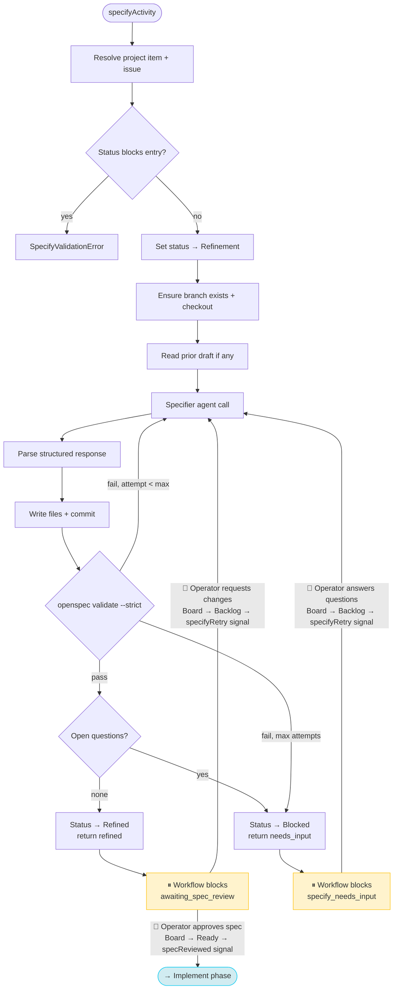
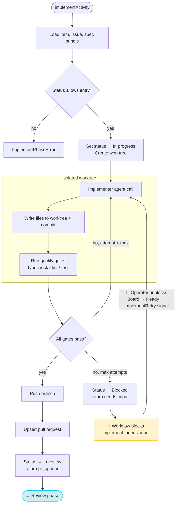

# Night Shift

Turn tickets into reviewable PRs with measurable quality, cost, and latency — so human engineers spend their time on the work that actually needs them.

See [`openspec/project.md`](openspec/project.md) for the project context and [`openspec/changes/`](openspec/changes/) for active changes.

## Setup

### Prerequisites

- **Node.js ≥ 22.9**
- **Temporal server** — install via [Temporal CLI](https://docs.temporal.io/cli) or run `temporal server start-dev`
- **GitHub App** — required for board integration, PR creation, and webhooks (see [GitHub App Setup](#github-app-setup) below)

### Install

For normal use in a target repository, install a pinned private Git revision:

```bash
# from the repository Night Shift should automate
npm install --save-dev 'git+ssh://git@github.com/your-org/night-shift.git#main'
```

For local development against a checkout of Night Shift itself, install a local
path dependency instead:

```bash
# absolute path
npm install --save-dev /abs/path/to/night-shift

# or a relative path if the repos are side by side
npm install --save-dev file:../night-shift
```

Night Shift is currently intended to stay private and be installed into each
target repository as a repo-local dependency. The private Git install is the
recommended stable mode for teams and CI because it pins the version per repo.
The local-path install is useful for dogfooding and development when you want a
consumer repo to follow your working tree directly.

Current local-path behavior: npm links both `node_modules/night-shift` and the
local `night-shift` bin back to the source checkout. There is no separate build
step today; the bin registers the bundled `tsx` runtime from the Night Shift
package itself, so source edits are picked up on the next command run. Reinstall
only when package metadata changes, such as `package.json` dependencies, `bin`,
or `exports`.

### Configure

Initialize a repo-local config file. `init` writes `night-shift.config.ts` and
prints the follow-up OpenSpec setup commands you need to run explicitly:

```bash
npm exec night-shift -- init
```

Key sections in [night-shift.config.example.ts](night-shift.config.example.ts):

| Section | Purpose |
|---|---|
| `roles` | Agent provider and model per role |
| `adapterFactories` | Optional custom adapter registry for repo-local providers |
| `qualityGates` | Toggle typecheck / lint / test gates |
| `github` | GitHub App credentials, repo, and project board ID |
| `pickup` | Auto-pickup: `enabled`, `intervalMinutes` (divisor of 60), `maxConcurrent` |
| `temporal` | Temporal server URL, namespace, task queue |

Config is discovered in order: explicit path → `NIGHT_SHIFT_CONFIG` env var → `night-shift.config.{ts,mts,mjs,js}` in cwd. Night Shift auto-loads `.env` next to the resolved config file before importing it.

Agent-specific repo guidance should come from what is set up in the repository
itself, not from Night Shift config.

If you start from a repo that has no OpenSpec setup yet, run `npm exec night-shift -- init` first, then follow the printed setup steps to install OpenSpec globally and run `openspec init .` in that repository before using the specifier.

### GitHub Setup

1. Create a **fine-grained PAT** at *Settings → Developer settings → Personal access tokens → Fine-grained tokens* with these repository permissions: **Contents**, **Issues**, **Pull requests**, **Projects** — all Read & write

2. Copy `.env.example` to `.env` and fill in your values:

```bash
cp .env.example .env
```

```env
# GitHub
GITHUB_TOKEN=ghp_...
GITHUB_PROJECT_OWNER=your-username-or-org
GITHUB_PROJECT_OWNER_TYPE=user          # user | org
GITHUB_PROJECT_NUMBER=1
GITHUB_REPO_OWNER=your-username
GITHUB_REPO_NAME=your-repo
```

The config reads these env vars automatically, and Night Shift auto-loads `.env` before evaluating `night-shift.config.ts`. The project's GraphQL node ID (`PVT_...`) is resolved from the project number at startup — no need to look it up manually.

`GITHUB_REPO_OWNER` and `GITHUB_REPO_NAME` select the GitHub repository Night Shift talks to over the API. The local checkout Night Shift reads and modifies is the repository where you run the CLI, unless you pass `--repo-root <path>`.

> **Tip:** For production, consider using a [GitHub App](https://docs.github.com/en/apps/creating-github-apps) instead of a PAT for bot identity, higher rate limits, and auto-rotating tokens. The config supports `appId` + `installationId` + `privateKeyPath` as an alternative — see [night-shift.config.example.ts](night-shift.config.example.ts).

> **Note:** Tests use an in-memory fake client automatically — no GitHub credentials needed for `npm test`.

### Verify

```bash
npm run typecheck
npm test
npm run lint:boundaries
```

### Run

```bash
# Start the Temporal dev server (separate terminal)
temporal server start-dev
```

Main worker run:

```bash
# Run inside the target repository
npm exec night-shift -- worker
```

This is the expected main mode. The current working directory is the selected repo root by default. To invoke Night Shift from another directory, use `npm exec --prefix /abs/path/to/target-repo night-shift -- <command> ...` or pass `--repo-root /abs/path/to/target-repo`.

Workflow control commands:

```bash
# Run inside the target repository, or use --repo-root when invoking elsewhere.

# Trigger a workflow for a project item
npm exec night-shift -- start <projectItemId> --change <change-name>

# One-shot: scan Backlog + Ready and start workflows
npm exec night-shift -- pickup
```

When `pickup.enabled` is `true` in your config, the worker automatically starts a cron workflow that scans the board every `intervalMinutes` — no separate command needed.

Manual phase runs:

```bash
npm exec night-shift -- specify --item <projectItemId> --change <change-name>
npm exec night-shift -- implement --item <projectItemId> --change <change-name>
npm exec night-shift -- review <projectItemId> [--iteration <n>]
```

`specify` and `review` open agent sessions in the selected repo root. `implement` opens its agent session in the per-ticket worktree created under that repo root.

`start` and `pickup` are different: they only talk to GitHub and Temporal, so they use the selected repo root only for config discovery and `.env` loading.

## Modules

- [`src/contracts/`](src/contracts/) — shared phase contracts (Ticket, I/O schemas, observability events). All downstream phases depend on this.
- [`src/adapters/`](src/adapters/) — normalised agent-SDK interface + provider adapters (Codex, Claude stub, in-memory fake). See [`src/adapters/README.md`](src/adapters/README.md).
- [`src/config/`](src/config/) — `night-shift.config.*` loader and `NightShiftConfigSchema`. See [`src/config/README.md`](src/config/README.md).
- [`src/github/`](src/github/) — typed wrappers around GitHub REST/GraphQL/webhooks for Projects v2, issues, labels, comments, branches, and PRs. See [`src/github/README.md`](src/github/README.md).
- [`src/git/`](src/git/) — minimal `GitOps` surface (real `simple-git` impl + in-memory fake). See [`src/git/README.md`](src/git/README.md).
- [`src/phases/specify/`](src/phases/specify/) — Specify phase runtime that converts a ticket into an OpenSpec change folder. See [`src/phases/specify/README.md`](src/phases/specify/README.md).
- [`src/phases/implement/`](src/phases/implement/) — Implement phase runtime that drives the implementer agent, runs quality gates in a worktree, and opens a PR. See [`src/phases/implement/README.md`](src/phases/implement/README.md).
- [`src/phases/review/`](src/phases/review/) — Review phase runtime that reviews PRs, posts findings as review comments, and produces a verdict. See [`src/phases/review/README.md`](src/phases/review/README.md).
- [`src/worktree/`](src/worktree/) — `WorktreeOps` surface for creating/removing per-ticket git worktrees. See [`src/worktree/README.md`](src/worktree/README.md).
- [`src/quality-gates/`](src/quality-gates/) — `QualityGateRunner` that executes typecheck/lint/test gates with per-gate timeouts and 4 KiB log truncation. See [`src/quality-gates/README.md`](src/quality-gates/README.md).
- [`src/orchestration/`](src/orchestration/) — Durable ticket workflow engine built on Temporal (workflow, activities, worker, webhook bridge). See [`src/orchestration/README.md`](src/orchestration/README.md).
- [`src/cli/`](src/cli/) — CLI entry points (`night-shift specify …`, `night-shift implement …`, `night-shift review …`, `night-shift worker`, `night-shift start …`, `night-shift pickup`).

## Developer Scripts

These scripts are for developing Night Shift itself from this repository. End users in target repositories should prefer `npm exec night-shift -- ...`.

- `npm run typecheck` — `tsc --noEmit`
- `npm test` — run Vitest suites
- `npm run lint:contracts` — guardrail: `src/contracts/**` imports only `zod` and siblings
- `npm run lint:boundaries` — guardrail: enforce import boundaries for `contracts`, `adapters`, `config`, `github`, `git`, `phases`, `worktree`, `quality-gates`, `orchestration`, and `cli` modules
- `npm run specify -- --item <projectItemId> --change <change-name>` — run the Specify phase entrypoint during Night Shift development
- `npm run implement -- --item <projectItemId> --change <change-name>` — run the Implement phase entrypoint during Night Shift development
- `npm run review -- <projectItemId> [--iteration <n>]` — run the Review phase entrypoint during Night Shift development
- `npm run worker` — start the Temporal worker entrypoint during Night Shift development
- `npm run start -- <projectItemId> --change <change-name>` — trigger a ticket workflow during Night Shift development
- `npm run pickup` — one-shot scan of Backlog + Ready columns during Night Shift development

## Workflow Phases

### Specify

Converts a ticket into a validated OpenSpec change folder (proposal, design, tasks).



### Implement

Drives the implementer agent in a worktree, runs quality gates, and opens a PR.



### Review

Reviews a PR, posts findings as review comments, and produces a verdict.


