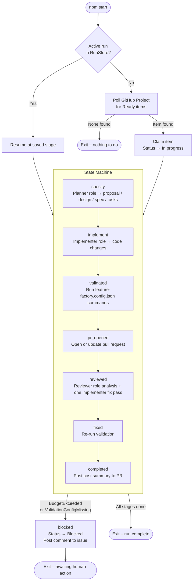

# Feature Factory – Minimal Agentic Orchestrator

An end-to-end TypeScript/Node orchestrator that picks up `Ready` tasks from a GitHub Project, derives an OpenSpec specification, implements the code, runs automated review, and opens a pull request with configurable provider/model selection for planner, implementer, and reviewer roles using the existing Codex SDK and Claude Agent SDK integrations.

---

## Quick Start

### 1. Prerequisites

| Tool | Purpose |
|------|---------|
| Node.js ≥ 20 | Runtime |
| `npm` | Dependency management |
| OpenAI API key | Required when any configured role uses the Codex SDK |
| GitHub token | Project + repo access (`project`, `repo` scopes) |
| Anthropic API key | Required when any configured role uses the Claude Agent SDK |

### 2. Install dependencies

```bash
npm install
```

### 3. Add a validation config to the target repository

The orchestrator requires a `feature-factory.config.json` file in the **root of the target repository** before it will run validation. Without this file the run is blocked with a clear comment.

```json
{
  "validation": {
    "commands": [
      "npm run typecheck",
      "npm test"
    ]
  }
}
```

### 4. Configure environment variables

Copy the example file and fill in your values:

```bash
cp .env.example .env
```

```bash
# GitHub
GITHUB_TOKEN=ghp_...
GITHUB_PROJECT_OWNER=your-username-or-org
GITHUB_PROJECT_OWNER_TYPE=user          # user | org
GITHUB_PROJECT_NUMBER=1
GITHUB_REPO_OWNER=your-username
GITHUB_REPO_NAME=your-repo
GITHUB_DEFAULT_BRANCH=main              # optional, default: main

# Anthropic
ANTHROPIC_API_KEY=sk-ant-...
ANTHROPIC_MODEL=claude-sonnet-4-6        # legacy/default fallback for anthropic-backed roles

# OpenAI / Codex SDK
OPENAI_API_KEY=sk-...
CODEX_MODEL=gpt-5-mini                   # legacy/default fallback for codex-backed roles

# Optional role-specific agent selection
AGENT_PLANNER_PROVIDER=codex             # codex | anthropic
AGENT_PLANNER_MODEL=gpt-5-mini           # optional; otherwise falls back by selected provider
AGENT_IMPLEMENTER_PROVIDER=anthropic     # anthropic | codex
AGENT_IMPLEMENTER_MODEL=claude-sonnet-4-6
AGENT_REVIEWER_PROVIDER=codex            # codex | anthropic
AGENT_REVIEWER_MODEL=gpt-5-mini

# Paths
REPO_DIR=/absolute/path/to/your/repo

# Optional overrides
DATA_DIR=./data/runs                    # default: ./data/runs
CODEX_ENABLED=true                      # default: true
BUDGET_SPECIFY=0.50                     # USD per specify stage
BUDGET_IMPLEMENT=2.00                   # USD per implement stage
BUDGET_REVIEW=0.50                      # USD per review stage
BUDGET_TOTAL=5.00                       # USD total per ticket
```

`.env` is loaded automatically on startup via `dotenv`. The `.env` file is git-ignored; use `.env.example` as the committed template.

When role-specific env vars are omitted, planner and reviewer default to the Codex SDK, implementer defaults to the Claude Agent SDK, and each role inherits the matching legacy model variable for its selected provider.

### 5. Run

```bash
npm start
```

The orchestrator claims one `Ready` item, advances through all stages, and exits. Run it again (via cron, GitHub Actions, or manually) to process the next item.

When the run reaches a terminal state a **structured run summary** is printed to stdout:

**Pretty format** (default on interactive TTY):

```
+---------------------------------------------------------------------------------+
| Ticket               | Stages                   | Duration | Cost (used/budget) |
+---------------------------------------------------------------------------------+
| FFH-123: Add widget  | validate → build → deploy| 00:07:13 | $12.40 / $20.00    |
| Status: completed                                                               |
+---------------------------------------------------------------------------------+
```

**JSON format** (default on CI / non-TTY):

```json
{
  "ticket_title": "FFH-123: Add widget",
  "stages_completed": ["validate", "build", "deploy"],
  "elapsed_seconds": 433,
  "cost_used": 12.4,
  "budget": 20.0,
  "status": "completed"
}
```

Control the format with:

```bash
npm start -- --summary-format json   # force JSON
npm start -- --summary-format pretty # force pretty
npm start -- --summary-format none   # suppress
```

See [docs/cli.md](docs/cli.md) for the full flag reference and precedence rules.

---

## Orchestrator Flow



---

## Project Structure

```
src/
  config.ts             – Config loader (zod-validated from env; includes output.runSummary.format)
  types.ts              – Shared types and error classes
  resume.ts             – Resume logic (deriveResumeStage, resolveResumeState)
  worker.ts             – State machine + single-emission RunSummary on terminal state
  index.ts              – CLI entrypoint (--summary-format flag parsing)

  store/
    RunStore.ts         – Disk-backed run state (state.json, events.jsonl, usage.json)
    RunInspector.ts     – Read-only queries over run artifacts (spec complete, impl progress, etc.)

  providers/
    ProviderAdapter.ts  – Provider interface (ProviderResult, ProviderRunOptions, ProviderAdapter)
    CodexAdapter.ts     – Codex SDK wrapper implementing ProviderAdapter
    ClaudeAdapter.ts    – Claude Agent SDK wrapper implementing ProviderAdapter
    AgentRunner.ts      – Role-based dispatch with budget enforcement and structured output

  github/
    GitHubAdapter.ts    – GitHub Projects v2 GraphQL + REST
    ReportPublisher.ts  – PR creation, milestone comments, cost summary

  workspace/
    RepoWorkspace.ts    – git branch/worktree lifecycle
    OpenSpecService.ts  – Per-run OpenSpec artifact directory management
    ValidationRunner.ts – Loads and runs validation commands from feature-factory.config.json

  output/
    summarizer.ts       – RunSummary model, EmitRunSummary API, format resolution, TTY detection
    formatter_pretty.ts – Pretty ANSI table renderer (durationToHHMMSS, trimStageList)
    formatter_json.ts   – Stable JSON renderer

  stages/
    StageContext.ts     – Unified context interface for all stages (Pick<> per stage)
    specify.ts          – Planner role → OpenSpec artifacts (proposal, design, spec, tasks)
    implement.ts        – Implementer role with repository tools → code changes
    review.ts           – Reviewer role analysis + one bounded implementer fix pass

tests/
  unit/                 – RunStore, AgentRunner, ValidationRunner, summarizer, resume, etc.
  contract/             – GitHubAdapter (mocked Octokit)
  integration/          – Crash recovery, blocked scenarios, validation happy path, summary emission

docs/
  cli.md                – CLI flag reference including --summary-format
```

## Run Directory Layout

Each ticket run is stored at `./data/runs/<ticketId>/`:

```
state.json            – Current RunState (stage, branch, PR number, etc.)
events.jsonl          – Append-only workflow event log
usage.json            – Per-step token usage and cost records
review-structured.json – Structured reviewer result payload
review-error.json     – Structured review failure envelope (when review fails)
review-findings.json  – Normalized ReviewFinding[]
validation-results.json – ValidationResult[]
implement-output.json – Structured implementation agent result payload
implement-summary.json – Parsed implementation summary
implement-error.json  – Structured implementation parse failure envelope
openspec/changes/     – Generated OpenSpec artifacts (proposal, design, spec, tasks)
```

## GitHub Project Status Mapping

| External Status | Meaning |
|----------------|---------|
| `Ready` | Eligible for orchestration |
| `In progress` | Claimed; spec/implement/validate running |
| `In review` | PR opened; review/fix loop active |
| `Blocked` | Cannot continue without human action |

`Done` is **not** set automatically. That remains a human team step after merge.

## Testing

```bash
npm run check          # typecheck + all tests
npm test               # tests only
npm run test:watch     # watch mode
```

See [TESTING.md](TESTING.md) for the full testing strategy.

## Manual Recovery

If a run is stuck:

1. Find the run directory: `ls ./data/runs/`
2. Read `state.json` to see the current stage and `blockedReason`.
3. If the issue is resolved, delete `./data/runs/<ticketId>/lock` and update `state.json` to a resumable stage.
4. Move the GitHub Project item back to `Ready`.
5. Run `npm start` again — the orchestrator will resume.

## Budget Behaviour

- If a stage total exceeds its configured budget, the run is blocked immediately after recording the triggering invocation.
- If the total ticket budget is exceeded, the run is blocked immediately after recording the triggering invocation.
- Cost per step is recorded in `usage.json` and posted as a comment on the PR on completion.

---

## Contributing — Dependencies

### Running the dependency scanner

```bash
# Find all manifests and lockfiles
find . -maxdepth 4 -type f \( -name "package.json" -o -name "package-lock.json" -o -name "yarn.lock" -o -name "pnpm-lock.yaml" \) | grep -v node_modules

# Check for peer-dependency conflicts
npm install --dry-run 2>&1 | head -40

# Audit for known vulnerabilities
npm audit --audit-level=high
```

### Adding `overrides` to fix a transitive conflict

1. Identify the conflicting transitive package (e.g. from `npm install` ERESOLVE output).
2. Add a minimal entry to `package.json#overrides`:

   ```json
   "overrides": {
     "some-package": "^X.Y.Z"
   }
   ```

3. Note the reason in a comment above the entry or in the commit message.
4. Run `npm install` to regenerate `package-lock.json`.
5. Commit **both** `package.json` and `package-lock.json` in the same commit.

### Regenerating lockfiles

```bash
# After changing package.json
npm install

# Verify clean install
npm ci

# Verify no drift
git status --porcelain   # should be empty after npm ci
```

### Validating locally before opening a PR

```bash
npm ci                         # clean lockfile-backed install
npm audit --audit-level=high   # 0 high/critical findings required
npm run typecheck              # TypeScript must pass
npm test                       # all tests must pass
```

See [docs/rollback-deps.md](docs/rollback-deps.md) for the rollback recipe if a dependency change causes regressions.
