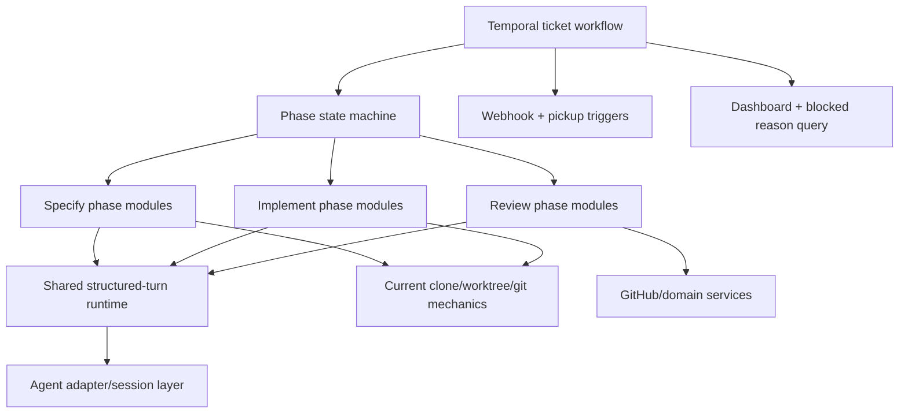

# Deterministic Phases Migration Map

## Purpose

This document turns the branch comparison into a concrete migration strategy.

Primary decision:

- use the **current `orchestrator` branch** as the **implementation base**
- use `origin/milestone-1-deterministic-phases` as the **workflow and architecture donor**

This is **not** the line-by-line implementation plan yet. It is the decision record that explains **what to keep, what to borrow, what not to copy as-is, and why**.

## Pinned comparison refs

This migration map is pinned to these compared snapshots:

- current-base snapshot: `c03e1cc617ede27c0ad3337671f324e5ffa4629a` (`c03e1cc`)
- donor snapshot: `214e90f8d9de7833975f764017557ea1741c9c2e` (`214e90f`)

Unless intentionally revised later, the keep/borrow decisions in this document refer to those snapshots.

## Recommendation summary

### Pick as the base: current branch

Reason: it is stronger in the operational mechanics that are hardest to rebuild safely:

- clone + cached-repo + worktree lifecycle
- retry-safe git / PR side effects
- hardened failure-path behavior under Temporal retries
- live GitHub-backed E2E coverage

### Borrow from the milestone branch

Reason: it is stronger in the long-term architecture:

- deterministic phase/state-machine workflow
- phase-local prompts, schemas, parsers, and error types
- richer GitHub/domain contracts
- webhook + pickup trigger model
- dashboard, blocking reasons, and human gates
- provider-neutral agent adapter abstraction

## Decision criteria

The comparison was evaluated on these dimensions:

1. repository/worktree mechanics
2. workflow/state-machine clarity
3. structured output design
4. GitHub/project integration
5. retry/recovery/debuggability
6. agent runtime abstraction
7. test and E2E confidence

## Side-by-side decision matrix

| Subsystem | Better branch | Why it wins |
| --- | --- | --- |
| Repository/worktree handling | Current | Self-sufficient clone cache, deterministic worktree recreation, stronger unattended automation behavior |
| Workflow/state machine | Milestone | Explicit phases, signals, blocked reasons, review loop, dashboard |
| Structured output contracts | Milestone | Phase-owned schemas and parsers are clearer and more meaningful |
| Structured output runtime mechanics | Current | Checkpoint/resume, same-thread execution, generic repair loop |
| GitHub direct side effects | Current | Simpler and more retry-safe PR/comment/project item behavior on the main path |
| GitHub domain model and triggers | Milestone | Canonical status model, webhooks, pickup flow, richer contracts |
| Failure/operator UX | Milestone | Better failure classification, blocked comments, clearer human recovery paths |
| Practical retry/idempotency | Current | More battle-tested around duplicate PRs, commit/push retries, cleanup behavior |
| Adapter/runtime abstraction | Milestone | Provider-neutral session interface and normalized event model |
| Live confidence | Current | Real GitHub-backed E2E harness with fake + real agent modes |

## What to keep from the current branch

### 1. Cached clone + worktree ownership model

Keep:

- `orchestrator/src/activity-worktree.ts`
- deterministic local clone cache under `/tmp/orchestrator/<owner>/<repo>`
- deterministic issue branch/worktree naming

Reason:

- it works from scratch without assuming a prepared local checkout
- it isolates automation from the operator's local repo state
- it already handles the "branch exists remotely" vs "new branch" split
- it is covered by focused tests

### 2. Retry-safe git and PR mechanics

Keep:

- `commitAndPush()` behavior that tolerates retry with already-created local commits
- duplicate-create PR recovery in `activity-github-pull-request.ts`
- current direct GitHub API calls for comment/PR/project item updates

Reason:

- these paths already encode real retry/idempotency lessons
- they are the exact class of bugs that tend to appear only under Temporal retries
- re-learning them inside the phased rewrite would add unnecessary risk

### 3. Structured output execution mechanics

Keep conceptually:

- heartbeat checkpoints
- resumable agent thread handling
- same-thread multi-turn execution
- generic repair capability for malformed structured output

Reason:

- the milestone branch has better contracts, but weaker generic runtime mechanics
- the current branch already knows how to survive activity retry and resume mid-sequence

### 4. Existing GitHub-focused workflow shell as the operational baseline

Keep as the migration starting point:

- `automateTopReadyIssue` currently does a complete Ready -> In progress -> In review path
- current project item claiming and failure status updates

Reason:

- it gives a working end-to-end baseline to refactor incrementally instead of replacing everything at once

### 5. Live GitHub E2E harness

Keep:

- `e2e/` workspace
- fake-agent and real-agent live modes
- real GitHub project/issue/PR assertions

Reason:

- this is the best regression detector for the migration
- the milestone branch has broad unit tests, but the current branch has better real integration confidence

## What to borrow from the milestone branch

### 1. Deterministic phase/state-machine workflow

Borrow:

- `Specify -> human spec gate -> Implement -> Review`
- explicit blocked reasons
- explicit signals (`specifyRetry`, `specReviewed`, `implementRetry`, `resume`)
- review escalation / resume loop
- the referenced branch's phase-state / blocked-reason / board-status / signal mapping as the starting contract

Reason:

- this is the main architectural improvement over the current linear workflow
- it makes human-in-the-loop behavior first-class instead of implicit
- it matches the actual lifecycle better than a single pass from Ready to PR

### 1a. Copy the transition contract first

For the first migration pass, copy the referenced branch's transition contract rather than redesigning it.

| Situation | Blocked reason | Board status | Human action | Workflow signal |
| --- | --- | --- | --- | --- |
| Specify needs input | `specify_needs_input` | `Blocked` | move item to `Backlog` | `specifyRetry` |
| Spec waiting for human review | `awaiting_spec_review` | `Refined` | move item to `Ready` | `specReviewed` |
| Spec changes requested after review | `awaiting_spec_review` | `Refined` -> `Backlog` | move item to `Backlog` | `specifyRetry` |
| Implement needs input | `implement_needs_input` | `Blocked` | move item to `Ready` | `implementRetry` |
| Review escalated | `review_escalation` | `Blocked` or `In review` | move item to `Ready` or `In review` | `resume` |

Reason:

- this removes unnecessary design churn before the first phased cutover
- it keeps the first migration aligned with the referenced branch's proven control flow
- any later simplification can happen after parity is working end-to-end

### 2. Phase-local prompt/response/parse/error modules

Borrow structure:

- `src/phases/specify/{prompt,response,parse,errors}.ts`
- `src/phases/implement/{prompt,response,parse,errors}.ts`
- `src/phases/review/{prompt,parse-or-prompt-owned-parse,errors}.ts`

Reason:

- each phase becomes easier to understand, test, and evolve
- contracts stay next to the code that consumes them
- this is clearer than driving workflow semantics through a global schema registry plus `resultKey`

### 3. Rich domain contracts

Borrow concepts:

- spec bundle contracts
- implementation result contracts
- review finding contracts
- canonical project status names

Reason:

- phase outputs become meaningful domain objects rather than opaque blobs in a generic output map
- this reduces ambiguity in downstream logic and tests

### 4. Provider-neutral adapter abstraction

Borrow:

- agent adapter/session boundary
- normalized turn options and result shape
- optional streamed event plumbing

Reason:

- current branch is too Codex-specific at the runtime seam
- the phased workflow will be easier to test and evolve if the provider integration is isolated

### 5. Webhook + pickup trigger model

Borrow:

- webhook bridge behavior
- pickup workflow / scheduled scan model
- mapping of board transitions to workflow starts vs signals

Reason:

- this is what makes the phase machine operational in day-to-day use
- without these triggers, the phased workflow would exist only as an internal refactor

### 6. Dashboard and operator-facing blocking semantics

Borrow:

- `getBlockedReason` query
- dashboard markdown/current details
- live activity progress reporting
- blocked comments with suggested next steps

Reason:

- operators need to understand why the workflow is waiting and what action unblocks it
- milestone branch is much better here than the current "move status and fail" behavior

### 7. Phase-specific error classification

Borrow:

- parse/schema/validation vs infrastructure error distinction
- non-retryable classification for deterministic contract failures

Reason:

- this prevents wasting retries on bad structured output or invalid phase entry conditions
- it makes failure handling cleaner and more intentional

## What should NOT be copied as-is

### 1. Do not adopt the milestone repo-root assumption

Do **not** switch to "the target repo already exists locally at `repoRoot`" as the primary model.

Reason:

- it would throw away one of the current branch's best operational strengths
- it increases coupling to local machine state
- it would require re-solving problems the current branch already solved

### 2. Do not replace the current structured-output runtime with only phase-local direct calls

Do **not** throw away checkpoint/resume/repair behavior just because the milestone branch does not generalize it.

Reason:

- the milestone branch improves contract design, not runtime resilience
- the best result is phase-local contracts on top of shared resilient execution helpers

### 3. Do not copy milestone cleanup behavior unchanged

Do **not** blindly preserve every failed worktree forever, and do **not** keep the current branch's aggressive cleanup unchanged either.

Reason:

- current cleanup is better for normal automation hygiene
- milestone preservation is better for exceptional debugging
- the target should be a hybrid policy, not either extreme

### 4. Do not adopt `--force-with-lease` by default without a branch ownership decision

Reason:

- this is a workflow policy decision, not just an implementation detail
- it is safe only if automation-owned branch semantics are explicit and tested

## Target architecture

The target system should be layered like this:

### Interpretation

- **top layer**: milestone-style phase/state machine
- **middle layer**: phase-local contracts and prompts
- **lower layer**: current branch's robust repo/worktree and retry-safe operational mechanics
- **cross-cutting**: milestone-style adapters, dashboard, and GitHub domain model

## Migration sequence

The safest path is an incremental migration, not a branch transplant.

### Stage 0: Freeze the baseline and expand regression coverage

Do:

- keep the current workflow green
- preserve current worktree/GitHub tests
- add or tighten assertions around current structured output checkpoints
- keep `e2e/` runnable throughout the migration

Reason:

- every later step should prove it did not break existing mechanics

### Stage 1: Normalize the project board to the referenced branch's status model

Do:

- adopt the referenced branch's canonical statuses as-is:
  - `Backlog`
  - `Refinement`
  - `Refined`
  - `Ready`
  - `In progress`
  - `In review`
  - `Ready to merge`
  - `Blocked`
- create any missing statuses/options on the GitHub Project using `gh` CLI
- freeze the copied blocked-reason / status / signal contract above as the migration baseline

Reason:

- `Specify` depends on the richer status model from day one
- the phased workflow is easier to port if the board already speaks the same language as the donor workflow
- per your direction, there is no need to add backward-compatibility mapping; just create the missing columns/options and use them

### Stage 2: Extract stable lower-level service boundaries from the current branch

Introduce or reshape internal seams around:

- worktree lifecycle
- git operations
- GitHub project/PR/comment operations
- structured agent turn execution

Reason:

- these seams let the future phased workflow call existing mechanics without keeping the current monolithic workflow shape
- this borrows milestone-style modularity without replacing behavior yet

### Stage 3: Introduce phase-local contracts before changing workflow control flow

Add current-branch equivalents of:

- `SpecifyResponse`
- `ImplementResponse`
- `ReviewerResponse`
- spec bundle / implementation result / review findings

Reason:

- contracts should be established before the new workflow depends on them
- this is the cleanest way to move away from `schemaId` + `resultKey` as the main design abstraction

### Stage 4: Add an adapter/session abstraction without changing the provider behavior

Refactor the current Codex integration behind a milestone-style adapter boundary, but keep Codex as the only real provider initially.

The adapter contract should be frozen before the shared helper is built and should explicitly cover:

- thread/session identity
- `outputSchema` passthrough
- cancellation
- progress events
- resume semantics

Reason:

- this prevents Codex-specific assumptions from hardening into the long-lived shared helper
- it isolates provider concerns before phase migration
- it reduces risk by changing architecture, not provider behavior

### Stage 5: Introduce a shared structured-turn helper backed by current mechanics

Build a helper that can:

- run a structured turn with provider `outputSchema`
- checkpoint/resume thread state
- parse + validate response
- optionally repair invalid output

Reason:

- this preserves the current branch's resilience while enabling milestone-style phase-local parsers

### Stage 6: Reshape the current Temporal workflow shell in place

Add a phased workflow that supports:

- phase state
- blocked reasons
- signals and query handlers
- dashboard/current details

Reason:

- this creates the orchestration container before phase logic is swapped in
- per your direction, there is no separate coexistence model; missing pieces should be layered onto the current workflow path one by one
- easier to test with mocked activities before porting real behavior

### Stage 7: Port Specify first

Port milestone ideas for:

- phase-local prompt
- phase-local schema/parser/error handling
- `needs_input` vs success result
- human spec review gate semantics

Before coding Specify, copy these donor-branch behaviors explicitly:

- item entry status behavior:
  - enter `Refinement` when starting Specify
  - exit to `Refined` on success
  - exit to `Blocked` on `needs_input`
- OpenSpec change-folder conventions under `openspec/changes/<changeName>`
- specifier retry semantics on validator failure
- open questions causing `needs_input`
- draft spec PR behavior and naming/body conventions
- issue comment markers / summary behavior used by the donor branch
- exact `specReviewed` vs `specifyRetry` gate behavior from the copied transition contract

But implement it using:

- current branch repo/worktree mechanics
- current branch GitHub API client foundations

Reason:

- Specify has the clearest human gate and introduces the new workflow shape early
- you explicitly want the first pass based on the referenced branch's Specify behavior
- documenting these donor-derived prerequisites now prevents rediscovery during implementation planning

### Stage 8: Port Implement second

Port milestone ideas for:

- implementer response contract
- quality gate loop
- `needs_input` result
- richer PR result semantics

Keep using:

- current cached clone/worktree model
- current retry-safe commit/push/PR mechanics unless explicitly superseded

Reason:

- Implement is where operational mechanics matter most, so this is where the hybrid design must be most conservative

### Stage 9: Port Review third

Port milestone ideas for:

- reviewer contract
- review findings
- review iteration loop
- escalation/resume behavior

Reason:

- Review depends on the earlier phase contracts existing
- it completes the deterministic phase model only after the foundations are ready

### Stage 10: Add webhook bridge and pickup model

Port:

- workflow trigger mapping
- scheduled pickup scan
- board transition -> signal/start rules

Reason:

- once the phased workflow exists, the milestone branch's operational trigger model becomes worth adding
- doing this too early would add operational complexity before the core phases are working

### Stage 11: Revisit policy choices after parity

After behavior parity is proven, decide explicitly whether to adopt:

- `--force-with-lease`
- hybrid cleanup/preservation policy
- richer GitHub status management semantics

Reason:

- these are policy choices best made after the hybrid architecture is already stable

## Keep / Rewrite / Borrow / Drop map

### Keep largely as-is

- current clone cache and worktree creation model
- current retry-safe commit/push behavior
- current PR duplicate recovery
- current GitHub-backed E2E harness
- current Temporal failure-path hardening

### Rewrite around the new architecture

- `automateTopReadyIssue` linear workflow shape
- generic `buildAgentSteps()`-driven orchestration semantics
- direct coupling between workflow meaning and generic `resultKey` output maps

### Borrow and adapt

- phased orchestration state machine
- phase-local prompt/response/parse modules
- domain contracts for spec/implement/review
- adapter/session abstraction
- dashboard/progress/blocking-reason model
- webhook + pickup trigger logic
- phase failure comments and error classification

### Drop as the long-term primary model

- current branch's single linear "Ready issue -> one agent sequence -> PR" orchestration shape
- milestone branch's assumption that the repo is already checked out locally

## Risks and mitigations

### Risk 1: architecture improves while operational resilience regresses

Mitigation:

- keep current git/worktree/PR mechanics in place until equivalent tests prove parity
- do not rewrite repo lifecycle and workflow architecture in the same step

### Risk 2: phase-local contracts become clean but lose retry-safe execution

Mitigation:

- freeze the adapter boundary before building the shared structured-turn helper
- preserve heartbeat/resume behavior as an explicit acceptance criterion

### Risk 3: webhook/pickup behavior is introduced before the new workflow is ready

Mitigation:

- add webhook/pickup only after the phased workflow shell and major phase ports exist

### Risk 4: cleanup policy makes debugging worse or leaks too much state

Mitigation:

- adopt a hybrid cleanup policy later as a deliberate design decision
- test success-path cleanup separately from exceptional-failure preservation

### Risk 5: E2E coverage lags behind architectural changes

Mitigation:

- update live E2E incrementally as each workflow milestone lands
- keep fake-agent live mode available as the cheaper high-signal check

## Validation checkpoints

Use stage-specific acceptance criteria instead of a single generic checklist.

### After Stage 1 (board normalization)

- verify the project has all required statuses/options
- verify the copied blocked-reason / signal contract is documented and reflected in tests/docs

### After Stage 2 (service seam extraction)

- existing worktree tests still pass
- existing GitHub activity tests still pass
- current workflow success/failure tests still pass

### After Stage 3 (phase-local contracts)

- contract schemas/parsers reject malformed payloads
- contract tests cover required fields and invariants for spec / implement / review

### After Stage 4 (adapter/session boundary)

- provider parity tests prove the adapter still supports current Codex behavior
- `outputSchema`, cancellation, and resume semantics are preserved through the adapter

### After Stage 5 (shared structured-turn helper)

- checkpoint/resume tests pass
- invalid structured output repair tests pass
- helper-level tests prove parse/validate/repair behavior is independent of phase-specific contracts

### After Stage 6 (in-place phased workflow shell)

- workflow tests cover blocked reasons, signals, queries, and stale-signal handling
- dashboard/current-details output updates correctly as phases and gates change

### After Stage 7 (Specify migration)

- status transitions `Refinement -> Refined/Blocked` are correct
- specifier validator retry behavior matches donor expectations
- draft spec PR and issue comment marker behavior matches donor expectations
- `specReviewed` and `specifyRetry` unblock the correct gates

### After Stage 8 (Implement migration)

- retry after local commit still works
- duplicate PR recovery still works
- `In progress -> In review/Blocked` transitions are correct
- `implementRetry` unblocks only the implement gate

### After Stage 9 (Review migration)

- reviewer structured output and findings parsing work
- needs-fix loops rerun implement/review correctly
- escalation/resume and `Ready to merge` behavior match donor expectations

### After Stage 10 (webhook/pickup)

- board-transition trigger tests match the copied transition contract
- pickup scans start/signal the right tickets
- end-to-end runs still pass in fake-agent live mode

### Baseline validation at every stage

- targeted unit tests for touched modules
- workflow/failure-path tests
- `make check`
- relevant `e2e` runs, starting with fake-agent live mode and then real-agent mode when behavior changes warrant it

## Final migration decision

### Implementation base

- **Current branch snapshot `c03e1cc617ede27c0ad3337671f324e5ffa4629a` (`c03e1cc`)**

### Architecture donor

- **`origin/milestone-1-deterministic-phases` snapshot `214e90f8d9de7833975f764017557ea1741c9c2e` (`214e90f`)**

### Core strategy

- preserve the current branch's operational mechanics
- replace the current branch's workflow shape with the milestone branch's deterministic phases architecture
- adopt milestone branch concepts where they improve clarity, contracts, and operator UX
- defer policy-level changes until after architectural parity is proven

This is the lowest-risk path to getting the best parts of both branches.