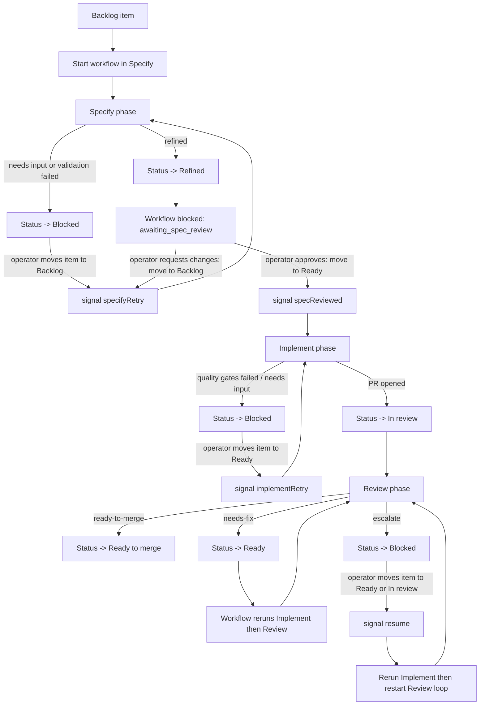
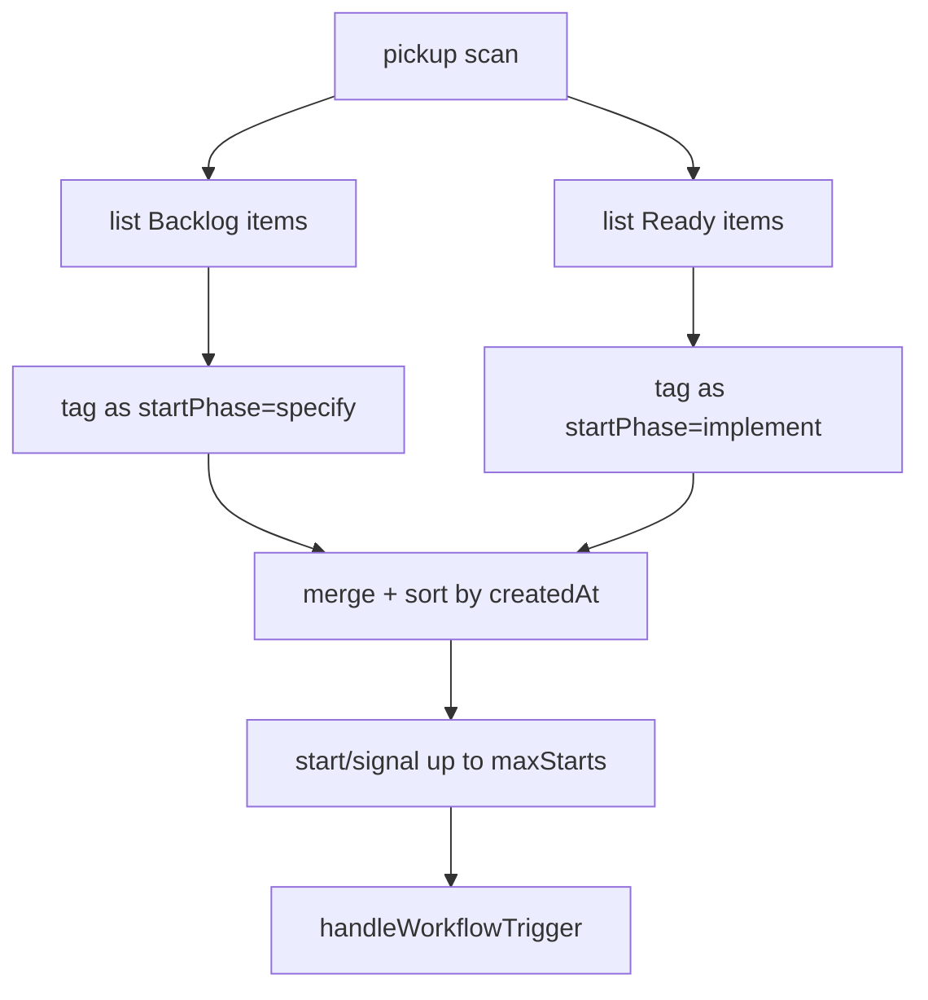
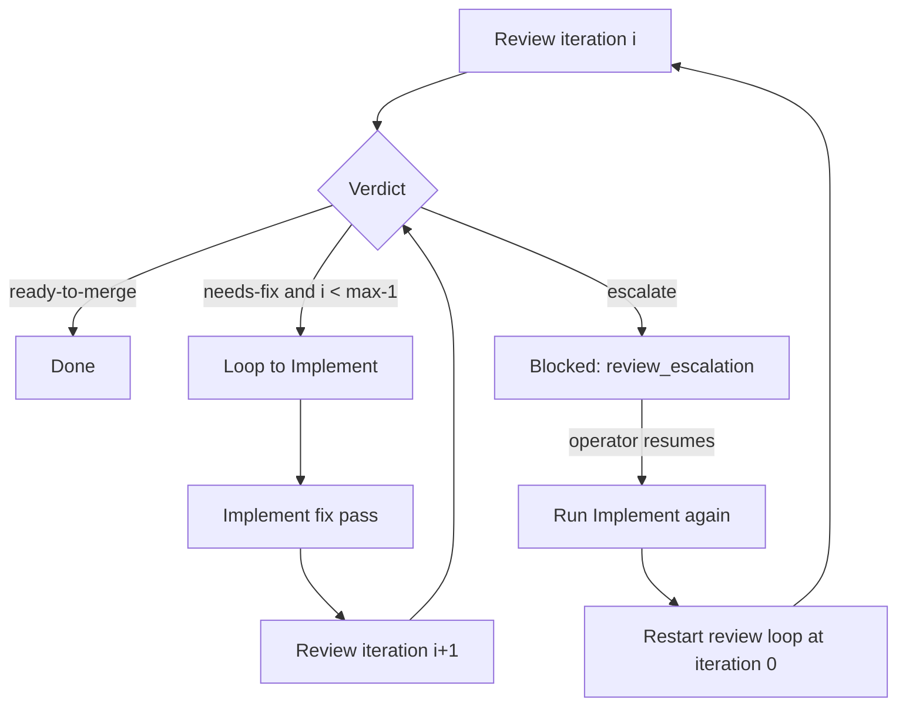

# Deterministic Phases Workflow Reference (`milestone-1-deterministic-phases`)

## Purpose

This document reverse-engineers the workflow implemented on `origin/milestone-1-deterministic-phases` so we can later re-implement the same **workflow structure** in the current `orchestrator` codebase while preserving the current branch's proven mechanics where possible.

It is a **reference/spec artifact**, not a proposal for new behavior.

## Primary source files

- `src/orchestration/workflow.ts`
- `src/orchestration/activities.ts`
- `src/orchestration/webhook-bridge.ts`
- `src/orchestration/pickup-workflow.ts`
- `src/orchestration/pickup-activities.ts`
- `src/phases/specify/{phase.ts,prompt.ts,response.ts,README.md}`
- `src/phases/implement/{phase.ts,prompt.ts,response.ts,README.md}`
- `src/phases/review/{phase.ts,prompt.ts,rendering.ts,README.md}`
- `src/github/{projects.ts,issues.ts,prs.ts,types.ts}`
- `src/orchestration/__test__/{workflow.test.ts,webhook-bridge.test.ts,pickup-activities.test.ts}`

## Executive summary

The branch implements a **deterministic, multi-phase ticket workflow** driven by Temporal and GitHub Projects statuses:

1. **Specify**: turn a GitHub issue into an OpenSpec change folder.
2. **Human spec gate**: wait for approval or requested changes.
3. **Implement**: apply the approved spec in a worktree, run quality gates, open/update a PR.
4. **Review**: review the PR against the spec, either approve, request fixes, or escalate.
5. **Human escalation gate**: if review escalates, wait for a human to resume.

The workflow is deterministic because all non-deterministic work is pushed into activities and each human gate is modeled as a named workflow blocking reason plus an explicit signal.

## Canonical GitHub board statuses

The workflow expects and/or creates these statuses:

- `Backlog`
- `Refinement`
- `Refined`
- `Ready`
- `In progress`
- `In review`
- `Ready to merge`
- `Blocked`

`src/github/projects.ts` ensures these options exist on the project status field when `manageStatusOptions` is enabled.

## Top-level workflow model

### Workflow identity and inputs

- Workflow type: `ticketWorkflow`
- Workflow id: `ticket-${ticketId}`
- Input:
  - `itemId`
  - `ticketId`
  - `changeName`
  - optional `profileId`
  - optional `maxReviewIterations` (default `3`)
  - optional `startPhase: "specify" | "implement"`

### Blocking reasons used by the workflow

- `specify_needs_input`
- `awaiting_spec_review`
- `implement_needs_input`
- `review_escalation`
- `null` when not blocked

### Signals used by the workflow

- `specifyRetry`
- `specReviewed`
- `implementRetry`
- `resume`
- `activityProgress` (for live dashboard markdown)

### Query used by the workflow

- `getBlockedReason`

## End-to-end lifecycle

## Trigger model: webhook + pickup + manual start

### Webhook / board transition behavior

`src/orchestration/webhook-bridge.ts` maps board transitions to either:

- start a new workflow, or
- signal an existing blocked workflow, or
- ignore the event.

| Board status seen | Action |
| --- | --- |
| `Backlog` and no workflow exists | start `ticketWorkflow` at `specify` |
| `Backlog` and workflow blocked on `specify_needs_input` or `awaiting_spec_review` | signal `specifyRetry` |
| `Ready` and workflow blocked on `awaiting_spec_review` | signal `specReviewed` |
| `Ready` and workflow blocked on `implement_needs_input` | signal `implementRetry` |
| `Ready` and workflow blocked on `review_escalation` | signal `resume` |
| `Ready` and no workflow exists / prior run is closed | start fresh workflow at `implement` |
| `In review` and workflow blocked on `review_escalation` | signal `resume` |

### Pickup behavior

`pickupWorkflow` / `pickup-activities.ts` scan `Backlog` and `Ready` items, merge them, sort by `createdAt`, and then start/signal up to `maxStarts` items per tick.

- `Backlog` items are tagged `startPhase: "specify"`
- `Ready` items are tagged `startPhase: "implement"`
- Signaled workflows count against the per-tick cap just like newly started ones

## Phase 1: Specify

### Purpose

Convert a project issue into an OpenSpec change folder and a draft spec-review PR.

### Entry conditions

The phase rejects entry when the item is already in any of:

- `Blocked`
- `Refined`
- `Ready`
- `In progress`
- `In review`
- `Ready to merge`

If the item is not already in `Refinement`, the phase sets it to `Refinement` before doing the agent call.

### Inputs and context gathered

- project item via `github.getItem(itemId)`
- linked issue via `github.getIssue(issueNumber)`
- issue comments via `github.listComments(issueNumber)`
- prior Night Shift comments are filtered out by marker prefix
- prior draft files from `openspec/changes/<changeName>` are loaded if present
- deterministic ticket branch: `branchNameFor(ticket)`
- worktree start point: `origin/<baseBranch>` (default `main`)

### Agent prompt: exact system prompt

> You are the Specifier role in the Night-Shift system.
> Given a product ticket, produce an OpenSpec-compatible change proposal.
> Your final message MUST be a single JSON object matching the provided schema.
> Never include explanatory prose outside the JSON.

### Agent prompt: exact user-message structure

The user message is assembled with these sections, in this order:

1. `# Ticket <ticket.id>: <ticket.title>`
2. `URL: ...`
3. optional `Labels: ...`
4. `## Description`
5. optional `## Comments` with chronological issue comments
6. optional `## Current draft` containing every existing change-folder file
7. `## Response` with these instructions:
   - return JSON object with keys `files`, `openQuestions`, `assumptions`, `risks`
   - `files` must include `proposal.md` and `tasks.md`
   - `files` may include `design.md` and `specs/<capability>/spec.md`
   - if unresolved questions block the spec, list them in `openQuestions`

On validation retry, the same message is resent with an appended section:

- `## Previous validation errors`
- raw validator error text
- `Fix these and return the full updated response.`

### Structured output contract

- `files: [{ path, content }]`
  - allowed paths only:
    - `proposal.md`
    - `design.md`
    - `tasks.md`
    - `specs/<capability>/spec.md`
- `openQuestions: string[]`
- `assumptions: string[]`
- `risks: string[]`

Additional rules:

- `proposal.md` and `tasks.md` are required
- duplicate file paths are rejected

### Phase algorithm

1. Resolve item, issue, comments.
2. Set status to `Refinement` unless already there.
3. Ensure ticket branch exists off base branch.
4. Create worktree from `origin/<baseBranch>`.
5. Read prior draft files from `openspec/changes/<changeName>`.
6. Open specifier session with role `specifier`.
7. Run agent with structured schema.
8. Parse response.
9. Write returned files under `openspec/changes/<changeName>`.
10. Commit as `specify(<ticket.id>): attempt <n>`.
11. Run `openspec validate <changeName> --strict`.
12. Retry once on validator failure (`maxAttempts` default `2`).
13. Decide result:
    - `refined` if validator passed and `openQuestions` is empty
    - `needs_input` if validator failed or `openQuestions` is non-empty

### GitHub side effects

If `refined`:

- push branch
- open/update **draft** PR titled `Spec: <ticket.id>: <ticket.title>`
- upsert issue comment marker `specify:summary`
- set item status to `Refined`

If `needs_input`:

- upsert issue comment marker `specify:summary`
- append validator errors when validation failed
- set item status to `Blocked`

### Workflow gating after Specify

If status is `refined`, workflow blocks on `awaiting_spec_review`.

- operator approves by moving item to `Ready` -> signal `specReviewed`
- operator requests changes by moving item back to `Backlog` -> signal `specifyRetry`

If status is `needs_input`, workflow blocks on `specify_needs_input`.

- operator answers questions and moves item to `Backlog` -> signal `specifyRetry`

## Phase 2: Implement

### Purpose

Read the approved spec bundle, implement the change in a per-ticket worktree, run quality gates, and open/update the implementation PR.

### Entry conditions

The phase rejects entry when the item is in:

- `Backlog`
- `Refinement`
- `Refined`
- `In review`
- `Ready to merge`
- `Blocked`

In practice this means `Ready` is the normal entry status. If the item is not already `In progress`, the phase sets it to `In progress` first.

### Inputs and context gathered

- project item + linked issue
- operator issue comments (Night Shift comments filtered out)
- spec bundle from `openspec/changes/<changeName>`
- deterministic branch via `branchNameFor(ticket)`
- per-ticket worktree via `worktree.create({ ticketId, branch })`

### Agent prompt: exact system prompt

> You are the Implementer role in the Night-Shift system.
> Given a product ticket and its approved spec bundle, produce the minimal
> set of code changes that satisfy the spec. Your final message MUST be a
> single JSON object matching the provided schema. Never include prose
> outside the JSON.

### Agent prompt: exact user-message structure

1. `# Ticket <ticket.id>: <ticket.title>`
2. `URL: ...`
3. optional `Labels: ...`
4. `## Description`
5. `## Spec bundle` including every spec-bundle file as fenced markdown
6. optional `## Comments`
7. optional `## Retry feedback`:
   - `Previous attempt #<n> failed with: <error>`
   - `Please address this before resubmitting.`
8. `## Response` with these instructions:
   - return JSON object with keys `filesWritten`, `commitMessage`, `summary`, `followUps`
   - `filesWritten` contains every created/modified file
   - `filesWritten` may be `[]` only when branch already contains the full implementation
   - each `path` must be a repo-relative POSIX path
   - absolute paths and `..` segments are rejected

### Structured output contract

- `filesWritten: [{ path, content }]`
- `commitMessage: string`
- `summary: string`
- `followUps: string[]`

Additional rules:

- file paths must be repo-relative POSIX paths
- no absolute paths
- no `..` segments
- no duplicate file paths

### Quality gates

Default CLI gates are:

- `typecheck`: `npm run typecheck`
- `lint`: `npm run lint:boundaries` (optional)
- `test`: `npm test`

Logs are truncated to 4 KiB in the contract.

### Phase algorithm

1. Resolve item, issue, comments.
2. Assert status allows implement.
3. Set status to `In progress` unless already there.
4. Create or reuse per-ticket worktree.
5. Read spec bundle files.
6. Open implementer session with role `implementer`.
7. Run agent with structured schema.
8. Write `filesWritten` into the worktree.
9. Commit using returned `commitMessage`.
10. Run configured quality gates.
11. Retry once on gate failure (`maxAttempts` default `2`), passing retry feedback into the next prompt.
12. If all gates pass:
    - push branch
    - open/update PR
    - set status `In review`
    - return `pr_opened`
13. If gates still fail after retries:
    - upsert summary comment
    - set status `Blocked`
    - return `needs_input`

### GitHub side effects

If `pr_opened`:

- PR title: `<ticket.id>: <ticket.title>`
- PR body contains:
  - `Closes <issue-url>`
  - Night Shift callout
  - implementation summary
- issue comment marker: `implement:summary`
- item status: `In review`

If `needs_input`:

- issue comment marker: `implement:summary`
- item status: `Blocked`
- worktree is intentionally left on disk for debugging

### Workflow gating after Implement

If phase returns `needs_input`, the workflow blocks on `implement_needs_input`.

- operator moves item to `Ready` -> signal `implementRetry`

## Phase 3: Review

### Purpose

Review the PR against the spec bundle and produce one of:

- `ready-to-merge`
- `needs-fix`
- `escalate`

### Entry condition

The item must be in `In review`, or the phase fails validation.

### Inputs and context gathered

- project item
- `proposal.md`, `tasks.md`, and optional `design.md` from `specBundle.specPath` at `pr.headSha`
- PR diff
- PR changed files list
- existing PR review comments (Night Shift marker comments filtered out)

### Agent prompt: reviewer message

There is **no separate reviewer system-prompt constant** in `review/prompt.ts`; the phase opens a reviewer session with role `reviewer` and sends a structured user message.

The user message contains:

1. ticket header / URL / labels / description
2. `## Spec bundle`
3. `## PR Diff`
   - full diff when under `maxDiffBytes` (default `65536`)
   - otherwise truncated diff + changed-files breakdown table
4. optional `## Existing review comments`
5. optional `## Retry feedback`
6. `## Response` requiring:
   - `summary`
   - `findings`
   - each finding has `severity`, `message`, optional `location`, optional `specRef`

### Structured output contract

- `summary: string`
- `findings: Finding[]`
  - `severity: "error" | "warning"`
  - `message: string`
  - optional `location: { file, line? }`
  - optional `specRef: string`

The phase retries **once** only when the first response fails schema validation.

### Verdict rule

`decideVerdict(findings, iteration, maxIterations)`:

- no error findings -> `ready-to-merge`
- error findings before final iteration -> `needs-fix`
- error findings on final iteration -> `escalate`

Warnings never block the verdict.

### GitHub side effects by verdict

#### `ready-to-merge`

- mark PR ready for review (`setPullRequestReady(true)`)
- create/update PR review summary with `APPROVE` (fallback `COMMENT` if self-review restricted)
- upsert inline review comments for findings with resolvable line locations
- upsert issue comment marker `review:summary`
- set item status to `Ready to merge`

#### `needs-fix`

- create/update PR review summary with `REQUEST_CHANGES` (fallback `COMMENT`)
- upsert inline review comments
- upsert issue comment marker `review:summary`
- set item status to `Ready`

#### `escalate`

- add escalation label (default `night-shift:escalation`)
- create/update PR review summary comment marker `review:escalation`
- upsert inline review comments
- upsert issue comment marker `review:escalation`
- set item status to `Blocked`

### Workflow behavior after Review

## Failure handling across all phases

Any thrown phase error is handled by `markPhaseFailureActivity`:

1. set item status to `Blocked`
2. upsert an issue comment describing:
   - phase that failed
   - root cause text
   - suggested next step

Suggested next step status is:

- `Backlog` after Specify failure
- `Ready` after Implement failure
- `Ready` after Review failure

The workflow attempt ends immediately after a phase failure.

## Dashboard / observability model

The workflow writes Markdown status via `setCurrentDetails(...)` containing:

- ticket id / change name
- phase pipeline
- running vs blocked vs completed status
- current review iteration
- cost / token rollup placeholder
- recent activity detail
- timeline table of completed phase attempts

Activities can signal live progress via `activityProgress`; `ActivityProgressReporter` summarizes:

- tool starts/results
- model messages
- turn completion / token usage
- turn failures

## Exact GitHub issue / PR handling patterns

### Issue comments are marker-upserted

The branch uses HTML marker comments to make updates idempotent, for example:

- `specify:summary`
- `implement:summary`
- `review:summary`
- `review:escalation`
- `workflow:phase-failure`

Comments with Night Shift markers are filtered out of later operator-context reads.

### Branch / change naming

- branch name: `night-shift/<ticket.id>-<slug>`
- change folder name from pickup/webhook path: `deriveChangeName(issueTitle, issueNumber)` -> `<slug>-<issueNumber>`

### Project board lookup behavior

- `listItemsByStatus` paginates project items
- only issues with matching status are selected
- results are sorted by `createdAt`
- project can be resolved either directly by `projectNodeId` or from `projectNumber + owner + ownerType`

## What this means for the current branch rewrite

### Workflow structure to copy from milestone branch

The future rewrite should copy these **high-level control-flow concepts**:

1. `Specify -> human review gate -> Implement -> Review`
2. explicit blocked reasons with named signals
3. deterministic review loop with bounded iterations
4. distinct GitHub statuses for each phase and gate
5. idempotent trigger handling from project-board transitions
6. marker-based issue comment / PR review upserts

### Current-branch mechanics that already exist and should likely be preserved

From the current `orchestrator` branch:

- durable Temporal workflow shell in `orchestrator/src/workflows.ts`
- current GitHub selection/status primitives:
  - `getTopReadyIssue`
  - `moveProjectItemStatus`
  - `openPullRequest`
  - `commentOnIssue`
- current worktree mechanics in `orchestrator/src/activity-worktree.ts`:
  - reusable base clone under `/tmp/orchestrator`
  - per-issue branch/worktree creation
  - retry-friendly commit/push behavior
  - cleanup behavior
- current agent execution engine:
  - `runAgentSequence`
  - structured outputs
  - checkpoint / retry / repair support
- current E2E and test harness investments

### Practical mapping

| Milestone branch concept | Likely current-branch implementation substrate |
| --- | --- |
| Specify phase | new phase on top of current Temporal/activity infrastructure |
| Implement phase | can reuse current worktree + PR + issue-comment mechanics |
| Review phase | new phase, but can reuse current GitHub/agent plumbing patterns |
| Board-triggered resume/start | adapt current workflow start logic to signal/block model |
| Prompt-per-phase contracts | reuse current structured-agent engine, swap prompt/step structure |

## Short takeaway

The milestone branch is **not** just a better prompt set. It is a different orchestration model:

- phase-oriented instead of one-shot
- human-gated instead of fully linear
- review-loop-driven instead of single-pass
- status/signal-driven instead of only activity sequencing

That is the key structure to port. The existing current-branch mechanics are still valuable, but they should sit **under** this phased state machine rather than define the workflow shape themselves.