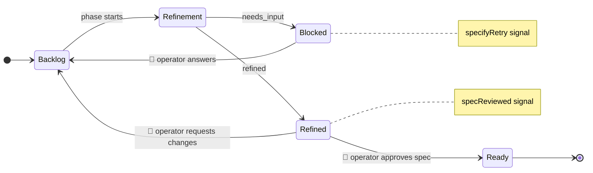
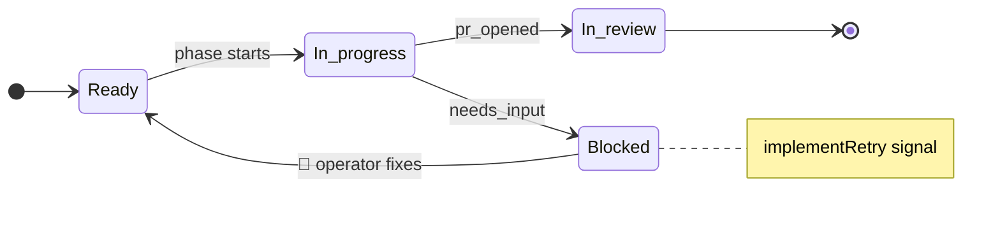
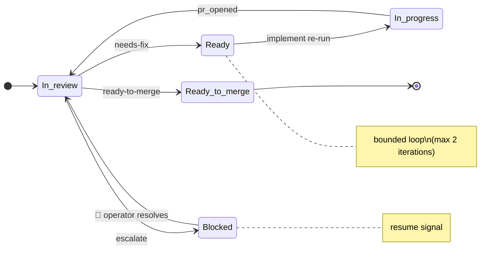

## Context

Changes 1–6 delivered the Specify, Implement, and Review phases as standalone
modules with CLI wrappers. Each phase reads a typed input contract and
produces a typed output, transitions GitHub project-item status, and emits
structured events. The three CLIs can be run by hand, but there is no durable
runtime that chains them, drives the review→fix loop, or reacts to GitHub
webhooks.

Temporal is the chosen workflow engine (decided in M1 planning). It provides
durable execution, automatic retries, event history, and a UI for observability
— all with strongly typed TypeScript APIs.

## Goals / Non-Goals

**Goals:**
- Chain Specify → Implement → Review in a single durable workflow per ticket.
- Automatically loop on `needs_fix` verdicts (Implement again, Review again)
  up to the max-iteration cap, then escalate.
- Pause on `escalate` verdicts and resume when a human moves the item back to
  `In review`.
- Start workflows from a webhook bridge (`project_v2_item.changed` →
  Backlog triggers workflow) and from a CLI (`night-shift start`).
- Ship a long-running worker (`night-shift worker`) that registers
  workflows + activities and processes the task queue.
- Expose workflow-level observability (start/finish, cost rollup, per-phase
  latency) through the existing event contract.
- Extend `NightShiftConfigSchema` with Temporal connection parameters.

**Non-Goals:**
- Multi-tenant hosting or Temporal Cloud integration (M1 uses local dev
  server).
- Agentic orchestration that dynamically chooses which phase to run (Milestone
  2 concern).
- Parallel ticket processing across multiple workers (single worker is fine for
  M1; Temporal handles it naturally later).
- Custom search attributes or advanced Temporal features beyond basic
  workflows, activities, and signals.

## Decisions

### 1. One workflow per ticket, identified by ticket ID

The workflow ID is `ticket-<ticketId>` so starting the same ticket twice is
idempotent (Temporal rejects duplicate IDs). The workflow accepts a
`TicketWorkflowInput` containing the project-item ID, ticket ID, and optional
profile overrides.

**Alternatives considered:**
- Workflow per phase — rejected because cross-phase state (iteration counter,
  spec bundle reference, PR ref) would need to be passed externally.
- Workflow per phase-pair — needless complexity for M1.

### 2. Activities wrap existing phase runners

Each phase runner (`runSpecifyPhase`, `runImplementPhase`, `runReviewPhase`)
becomes a Temporal activity. The activity function builds the real deps
(GitHub client, agent adapter, fs, clock) from config — the same setup the
CLIs do today — and calls the phase runner. Activity retries use Temporal's
built-in retry policy (initial 1 s, max 5 attempts, backoff 2×) for
transient failures; phase-level errors (validation, escalation) are
non-retryable application failures.

**Alternatives considered:**
- Calling CLI subprocesses — rejected because it loses type safety and
  structured results.
- Inlining phase logic in activities — rejected to preserve phase
  independence.

### 3. Human gates use Temporal signals — one workflow, visible gaps

The ticket lifecycle has **four** human gates where the workflow must pause.
Each gate uses `workflow.condition()` waiting for a named signal:

| # | Gate | Phase outcome | Item status | Signal name | Triggered by webhook |
|---|---|---|---|---|---|
| 1 | Spec needs input | specify → `needs_input` | Blocked | `specifyRetry` | Item moved to Backlog |
| 2 | Spec review | specify → `refined` | Refined | `specReviewed` | Item moved to Ready |
| 3 | Implement blocked | implement → `needs_input` | Blocked | `implementRetry` | Item moved to Ready |
| 4 | Review escalation | review → `escalate` | Blocked | `resume` | Item moved to In review |

**Specify phase has two possible outcomes:**
- `refined` → item is in `Refined`, workflow waits for `specReviewed`
  signal (human approves spec, moves to `Ready`).
- `needs_input` → item is in `Blocked` (open questions or validator fail),
  workflow waits for `specifyRetry` signal (human answers questions, moves
  to `Backlog`). On receiving the signal the workflow **re-runs specify**.

**Implement phase has two possible outcomes:**
- `pr_opened` → item is in `In review`, workflow proceeds to review loop.
- `needs_input` → item is in `Blocked` (quality gates failed), workflow
  waits for `implementRetry` signal (human fixes code, moves to `Ready`).
  On receiving the signal the workflow **re-runs implement**.

**Review phase has three possible outcomes:**
- `ready-to-merge` → done.
- `needs-fix` → workflow re-runs implement + review (bounded loop).
- `escalate` → item is in `Blocked`, workflow waits for `resume` signal
  (human resolves, moves to `In review`). On signal, re-enters review loop.

All gates use the same mechanism: the workflow sleeps at zero cost until
a signal arrives. In the Temporal UI this renders as a **single continuous
timeline per ticket** with idle gaps during human gates:

```
[specify] ── ⏸ blocked (needs input) ── [specify] ── ⏸ spec review ──
  [implement] ── ⏸ blocked (QG fail) ── [implement] ──
  [review] ── ⏸ escalation ── [review] ── ✓
```

Each signal event appears as a marker on the timeline, making it clear
exactly when and how long the human took to act.

**Blocked is a single GitHub status.** All three phases call
`setStatus(itemId, "Blocked")` — there are no distinct Blocked sub-statuses
in GitHub Projects. The workflow disambiguates by tracking an internal
`blockedReason` field (`"specify_needs_input" | "awaiting_spec_review" |
"implement_needs_input" | "review_escalation"`) so the webhook bridge knows
which signal to send. The `blockedReason` is workflow-internal state, not
stored in GitHub.

**Phase flow diagrams:**

### Specify phase



### Implement phase



### Review phase



**Alternatives considered:**
- Separate workflows per phase — rejected because it fragments the
  timeline; you'd lose the single-ticket view and need external
  correlation to understand end-to-end flow.
- Polling activity — works but wastes activity slots and adds latency.

### 4. Review→fix loop is a workflow loop, not recursion

The workflow uses a bounded `for` loop (`iteration = 0; iteration < maxIterations`)
that calls `implementActivity` then `reviewActivity`. On `ready-to-merge` the
loop breaks. On `needs_fix` it continues. On `escalate` it signals a wait
(see below). This keeps the event history linear and easy to inspect.

### 5. Escalation and blocked gates use Temporal signals to resume

When any phase sets the item to `Blocked`, the workflow enters
`workflow.condition()` waiting for a signal. The webhook bridge sends the
appropriate signal when it detects the operator moving the item:

- Blocked (specify) → operator moves to Backlog → `specifyRetry` signal
- Blocked (implement) → operator moves to Ready → `implementRetry` signal
- Blocked (review) → operator moves to In review → `resume` signal

This avoids polling and keeps the workflow sleeping (free) while waiting for
human intervention. The same signal pattern is used for the Refined→Ready
gate (Decision 3) — the only difference is the signal name and the
transition that triggers it.

Unexpected phase failures follow a different path. If specify, implement, or
review throws after retries are exhausted, the workflow does **not** enter a
resume gate. Instead it runs a small orchestration activity that sets the item
to `Blocked` and upserts a ticket comment with the failing phase, root cause,
and the intake status for the next attempt (`Backlog` after specify failures,
`Ready` after implement/review failures). The workflow then exits so the next
operator move back to intake starts a fresh workflow attempt rather than
resuming mid-phase.

**Alternatives considered:**
- Polling activity that checks item status every N minutes — works but wastes
  activity slots and complicates testing.
- Timer + poll hybrid — unnecessary given Temporal signals.

### 6. Webhook bridge is a thin HTTP handler, not a Temporal workflow

The bridge receives the GitHub webhook, verifies the signature (using the
existing `handleWebhook`), and:
- Starts a workflow on Backlog transition (new ticket OR specify retry).
- Sends `specReviewed` signal on Ready transition (human approved the spec).
- Sends `implementRetry` signal on Ready transition (human fixed code after
  quality gate failure — disambiguated from spec review by checking whether
  the workflow is in a post-implement blocked state).
- Sends `resume` signal on In review transition (human unblocked escalation).

It is a plain function mountable in any HTTP framework.

### 7. Worker is a single-process CLI command

`night-shift worker` boots a Temporal worker with one task queue
(`night-shift`), registers the workflow and all activities, and blocks until
SIGINT/SIGTERM. For M1, one worker is sufficient. Temporal natively supports
scaling to multiple workers on the same queue later.

### 8. Config extends NightShiftConfigSchema

```
temporal:
  serverUrl: string        # default "localhost:7233"
  namespace: string        # default "default"
  taskQueue: string        # default "night-shift"
```

All three fields have defaults so Temporal config is optional for local
development with `temporal server start-dev`.

### 9. Observability uses existing event contract

Activities emit `phase.started` / `phase.finished` as they already do. The
workflow emits `workflow.started` and `workflow.finished` (new event types
added to the event contract) with a cost/token rollup across all phases.

The workflow accumulates cost in a workflow-local `costRollup` accumulator
(`{ totalMicroUsd: number, totalTokens: number }`). After each successful
activity invocation, the workflow extracts the phase result's usage data
and adds it to the accumulator. Because the review loop can invoke
implement and review multiple times, the accumulator MUST sum across all
iterations, not just the last one. The accumulator is emitted with
`workflow.finished` regardless of terminal status (`completed`,
`escalated`, `error`).

### 10. Signal buffering and idempotency

Temporal buffers signals received before a `workflow.condition()` is
entered. Without care this leads to a footgun: rapid operator toggles
(Backlog→Ready→Backlog) can leave a stale `specifyRetry` signal in the
buffer that immediately unblocks the *next* unrelated `condition()` call.

The workflow MUST guard against this with explicit consumed-flag state.
For each signal (`specifyRetry`, `specReviewed`, `implementRetry`,
`resume`), the handler sets a boolean flag (e.g. `specifyRetryRequested`).
The `workflow.condition()` waits on `flag === true`, then immediately
clears the flag before proceeding. Signals received outside the
corresponding gate are ignored (flag is set but no condition is waiting,
and the flag is reset on entry to each gate).

Concretely, the workflow resets all gate flags to `false` at the
beginning of each gate it enters. This makes signal handling idempotent
with respect to operator toggles and prevents cross-gate leakage.

## Risks / Trade-offs

- **[Temporal dependency]** Temporal adds a heavyweight dependency (server +
  SDK). → *Mitigation:* M1 uses `temporal server start-dev` (single binary,
  no DB). The SDK is well-maintained and typed. Temporal is isolated behind
  `src/orchestration/`; phases remain Temporal-unaware.

- **[Signal delivery lag]** If the webhook bridge is down when a human
  resumes an escalated ticket, the signal is lost. → *Mitigation:* The
  worker can optionally run a startup sweep that checks `Blocked` items
  against their workflow state and re-signals. This is a follow-up
  enhancement, not M1-blocking.

- **[Long-running workflows]** A ticket stuck in review loops could run for
  hours. → *Mitigation:* Temporal handles this natively; workflows sleep
  between activities. A workflow-level timeout (configurable, default 4 h)
  prevents unbounded runs.

- **[Activity timeout tuning]** Agent calls (Codex, Claude) can be slow. →
  *Mitigation:* Activity start-to-close timeout set to 15 minutes
  (configurable). Heartbeats every 30 s during agent calls.
