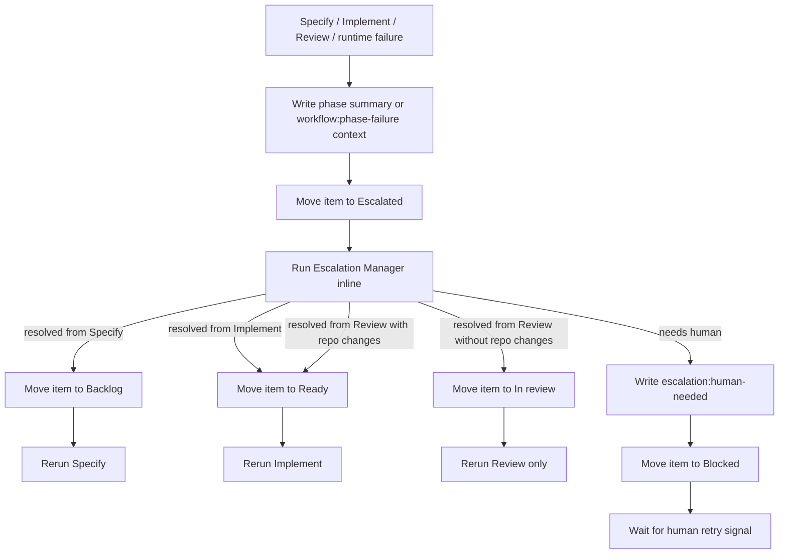
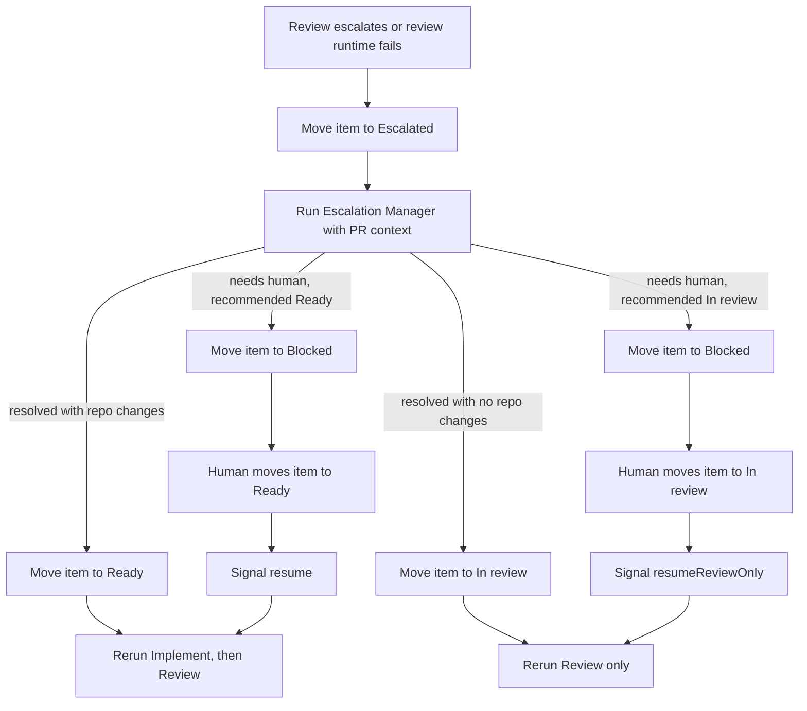

# Night Shift Workflow

This document describes the current workflow behavior in `src/workflows.ts`, including the inline Escalation Manager.

## Status meanings

- `Escalated` means Night Shift is attempting automated recovery in the current workflow, worktree, and branch.
- `Blocked` means escalation has already produced a human handoff and the workflow is waiting for an operator signal.
- `WorkflowBlockedReason` values still describe the waiting gate (`specify_needs_input`, `implement_needs_input`, `review_escalation`, `awaiting_spec_review`); they are not board statuses.

## Overall recovery flow

## Phase behavior

### Specify

- Starts from `Backlog`.
- Successful Specify writes OpenSpec files, validates them, opens or updates a draft PR, and moves the item to `Refined` while the workflow waits on `awaiting_spec_review`.
- Open questions no longer move directly to `Blocked`; the workflow writes `specify:summary`, moves the item to `Escalated`, and lets escalation try to repair or narrow the missing context.
- If escalation resolves the issue, the item returns to `Backlog` and Specify reruns.
- If escalation needs a human, the item moves to `Blocked` and waits for `specifyRetry`.

### Implement

- Starts from `Ready`.
- Successful Implement writes repository files, passes `make check`, commits, updates the PR, and moves the item to `In review`.
- Missing spec context, deterministic contract failures, exhausted quality-gate repairs, and eligible runtime failures now route through `Escalated` first.
- Resolved Implement escalation returns the item to `Ready` and reruns Implement in the same worktree and branch.
- Human fallback moves the item to `Blocked` with `implement_needs_input`, preserving both `implementRetry` and `specifyRetry` paths.

### Review

- Starts from `In review` once Implement has an active PR.
- Normal `needs-fix` verdicts still move the item to `Ready` and rerun Implement, incrementing the review iteration.
- Final-iteration review escalation now routes through `Escalated` instead of directly to `Blocked`.
- Eligible thrown review failures also route through Escalation Manager when the workflow already owns issue, PR, and worktree context.

## Review recovery branches

## Human board moves and signals

| Workflow blocked reason | Human board move | Orchestrator signal | Result |
| --- | --- | --- | --- |
| `specify_needs_input` | `Backlog` | `specifyRetry` | Rerun Specify. |
| `awaiting_spec_review` | `Ready` | `specReviewed` | Enter Implement. |
| `awaiting_spec_review` | `Backlog` | `specifyRetry` | Rerun Specify. |
| `implement_needs_input` | `Ready` | `implementRetry` | Rerun Implement. |
| `implement_needs_input` | `Backlog` | `specifyRetry` | Return to Specify with the same issue. |
| `review_escalation` | `Ready` | `resume` | Reset review iteration and rerun Implement, then Review. |
| `review_escalation` | `In review` | `resumeReviewOnly` | Reset review iteration and rerun Review only. |

## Intake rules

- Pickup scans `Backlog` and `Ready` only.
- `Escalated` never starts a new workflow. It is recovery-only and should belong to an existing open ticket workflow.
- Manual intake may target `Escalated` so operators can inspect recovery-owned items through the shared intake path, but a missing or closed workflow still resolves to `noop` instead of starting detached automation.

## Comment markers

- `specify:summary`, `implement:summary`, `review:summary`, and `review:escalation` remain the phase-facing summaries.
- `escalation:summary` records a successful automated recovery.
- `escalation:human-needed` records the final human handoff before moving the item to `Blocked`.
- `workflow:phase-failure` is still written when a thrown phase failure survives escalation and becomes a human fallback.

Escalation comments are intentionally operator-facing summaries with the PR link when one exists. They do not embed full changed-file contents.
